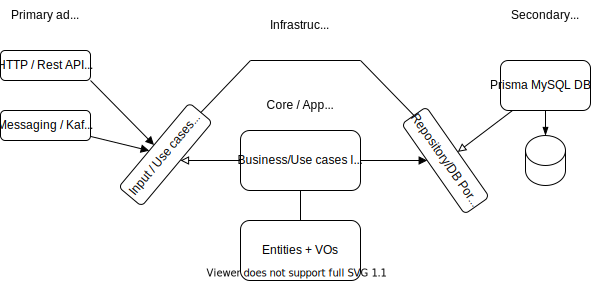

# NestJS Clean Architecture Example

Notifications microservice built with NestJS + Prisma (MySQL DB for test purposes), following a Clean Architecture approach. If you are coming from Java you can always check some of my other repositories using clean architecture, example: https://github.com/alexmarqs/musicweather-api-clean-architecture!


## Installation

```bash
$ yarn
```

## Diagram



## Open API (Swagger)

```bash
$ yarn start:dev
```

Then, open your browser and go to http://localhost:3000/api

## Kafka

We could use Docker (docker-compose) to run Kafka. However this time we will use Upstash, a Redis-like service (free tier) that also provides a Kafka instance. You can check it out here: https://upstash.com/

## Running the app

```bash
# development
$ yarn start

# watch mode
$ yarn start:dev

# production mode
$ yarn start:prod

# run prisma migrations in dev mode
$ yarn prisma:migrate:dev

# open prisma studio
$ yarn prisma:studio
```

## Test

```bash
# unit tests
$ yarn test

# e2e tests
$ yarn test:e2e

# test coverage
$ yarn test:cov
```
